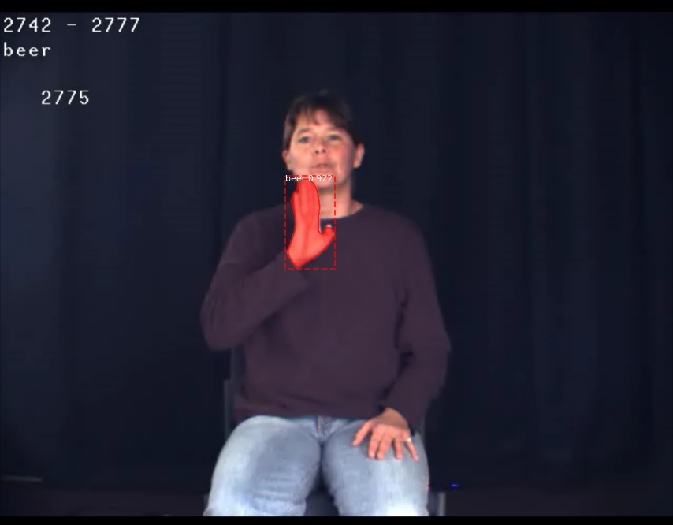

# Mask-RCNN for Sign Language Detection

This project was done as a Capstone Project under guidance of Sureshkumar Ramasamy which used Mask-RCNN for Sign Language detection.The dataset used was American Sign Language dataset.

The codes are based on implementation of Mask R-CNN by (https://github.com/matterport/Mask_RCNN) on Python 3, Keras, and TensorFlow. The model generates bounding boxes and segmentation masks for each instance of an object in the image. It's based on Feature Pyramid Network (FPN) and a ResNet101 backbone

The repository includes:

Source code of Mask R-CNN built on FPN and ResNet101.
Instruction and training code for the ASL dataset.
Pre-trained weights on MS COCO.
Jupyter notebooks to visualize the detection result.

# Training on your own dataset

Pre-trained weights from MS COCO and ImageNet are provided for you to fine-tune over new dataset. Start by reading this blog post about the balloon color splash sample. It covers the process starting from annotating images to training to using the results in a sample application.

In summary, to train the model you need to modify classes in ```ASL.py```:
 
1. ```GestureConfig``` This class contains the default configurations. Modify the attributes for your training, most importantly the NUM_CLASSES.
2. ```GestureDataset``` This class inherits from utils.Dataset which provides capability to train on new dataset without modifying the model. In this project dataset was labeled by VGG Image Annotation(VIA). If you are also trying to label a dataset for your own images, start by reading this blog post about the balloon color splash sample. First of all, for training you need to add class in function load_gesture

```
self.add_class("SourceName", ClassID, "ClassName")
For example:
self.add_class("ASL", 1, "all2")  #means add a class named "all2" with class_id "1" from source "ASL"
......
```

3. The data directories for this project are as following. Make sure you include corresponding annotations(.json) in correct directory.

```
dataset
|--train
|    |--81.jpg
|    |--83.jpg
|    |--....
|    |_ via_project_region.json
|--val
|    |--82.jpg
|    |--84.jpg
|    |--....
|    |--via_project_region.json
```

Now you should be able to start training on your own dataset! Training parapeters are mainly included in function train in ASL.py.
```
#Training on COCO
!python ASL.py train --dataset='/content/drive/My Drive/AI/Capstone Project/Mask_RCNN/dataset' --weights=coco

#Training on ImageNet
!python ASL.py train --dataset='/content/drive/My Drive/AI/Capstone Project/Mask_RCNN/dataset' --weights=imagenet

#Continue training the model from where you last left off
!python ASL.py train --dataset='/content/drive/My Drive/AI/Capstone Project/Mask_RCNN/dataset' --weights=last
```

# Predicting & Evaluating

Directly running the model in inference mode will help your testing part like below & then loading the weights
```
# Setting model to Inference mode
model = modellib.MaskRCNN(mode="inference", model_dir=MODEL_DIR,config=config)

# Loading the final weights obtained after training
print("Loading weights ", weights_path)
model.load_weights(weights_path, by_name=True)#Loading the weights
```

# Instance Segmentation on the  dataset




# Acknowledgements


This repository heavily reuses code from the amazing [tensorflow Mask RCNN implementation](https://github.com/matterport/Mask_RCNN) by [@waleedka](https://github.com/waleedka/).
Many thanks to all the contributors of that project.
You are encouraged to checkout [https://github.com/matterport/Mask_RCNN](https://github.com/matterport/Mask_RCNN) for documentation on many other aspects of this code.

The dataset was an outcome of a project which was discussed in the following paper
V. Athitsos, C. Neidle, S. Sclaroff, J. Nash, A. Stefan, Q. Yuan and A. Thangali, The ASL Lexicon Video Dataset, CVPR 2008 Workshop on Human Communicative Behaviour Analysis (CVPR4HB'08)

Dataset: American Sign Language Lexicon Video Dataset

Developers:
1. Stan Sclaroff, Professor of Computer Science, Boston University
2. Carol Neidle, Professor of French and Linguistics, Boston University
3. Vassilis Athitsos, Associate Professor of Computer Science and Engineering,University of Texas, Arlington
4. J. Nash, A. Stefan, Q. Yuan and A. Thangali

Project was built entirely on Google Colaboratory

# Configurations

Tensorflow 1.3.4

Keras 2.0.8

Python 3.7

The above versions can be easily changed in Google Colaboratory & remain only for the time the Runtime is connected, once disconnected it changes back to the latest version unlike Jupyter.
